# Portfolio-Django-Project-Training

## Task 2 - (In your project , create two models students and courses and make crud operations once using shell)

### Create

- 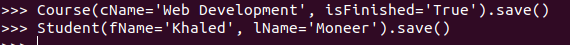

### Read

- 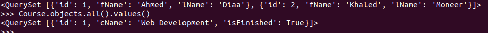

### Update

- 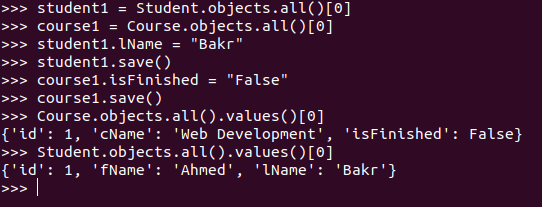

### Delete

- 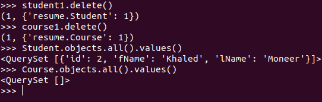

## Task 3 - (In your project , use validation to your form and models and use django admin for crus operation.)

### Model Validation 

- 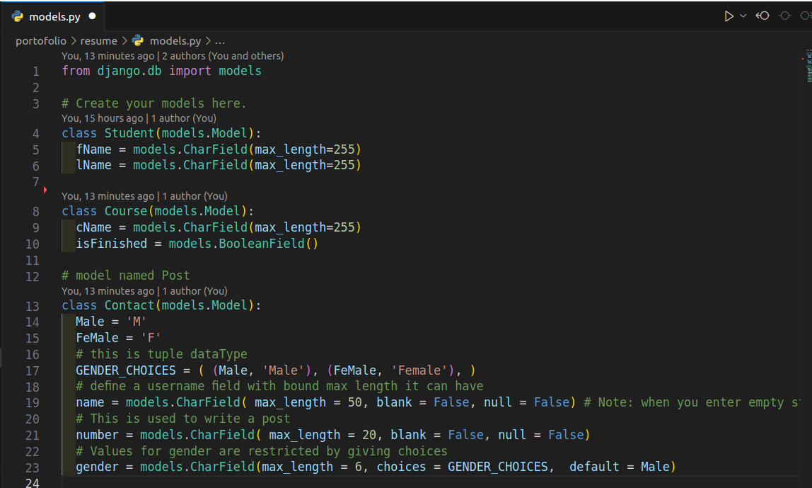

### Form Validation 

- 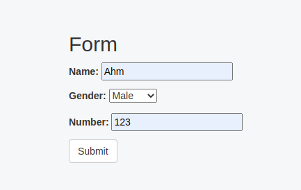
- 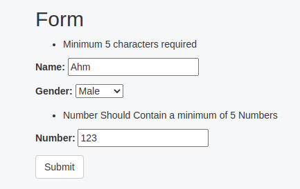
- 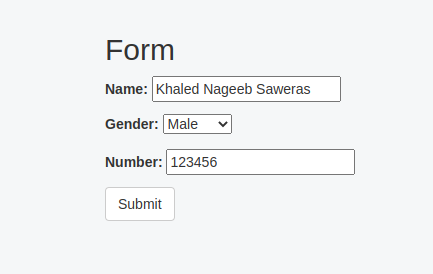
- 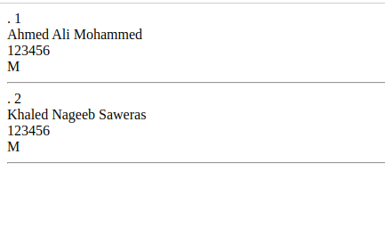

### Django Admin CRUD Operations.

#### Read

- 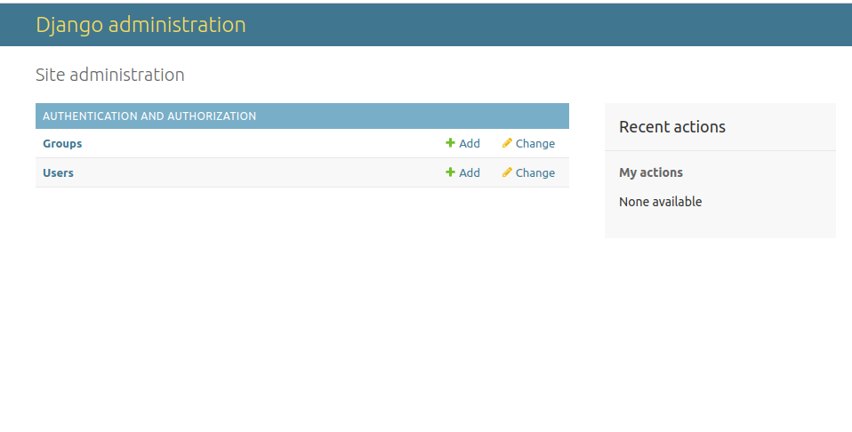
- 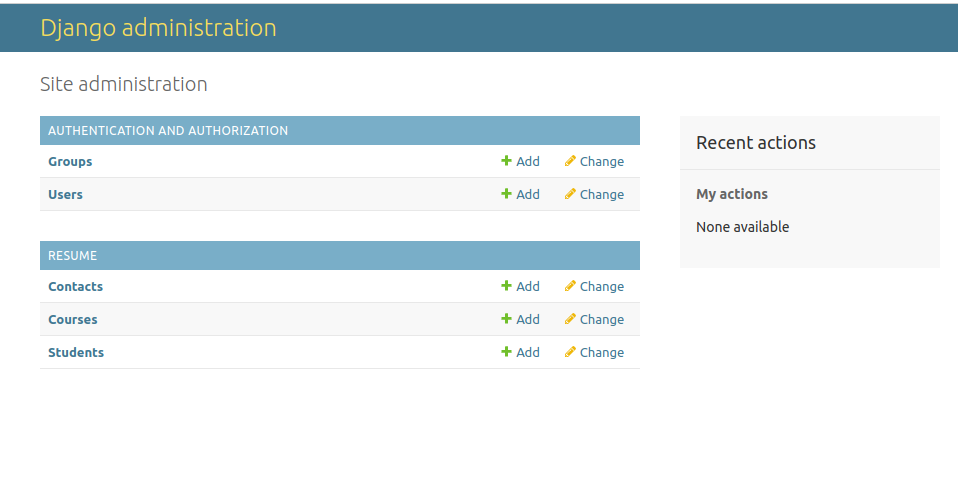
- 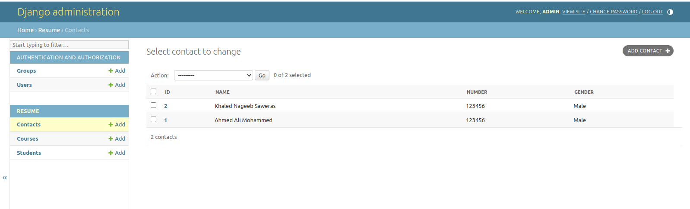
- 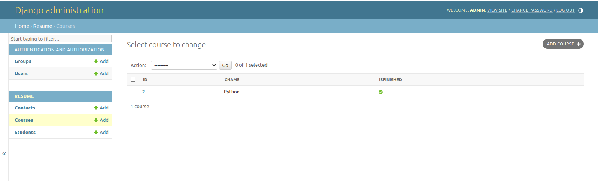
- 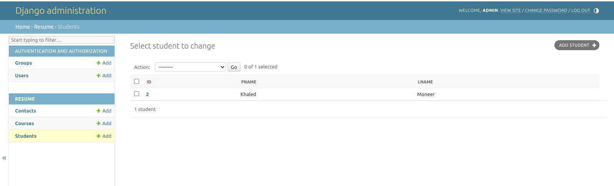

### Create

- 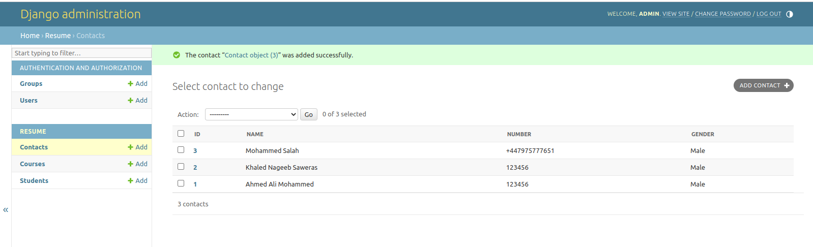

#### Update

- 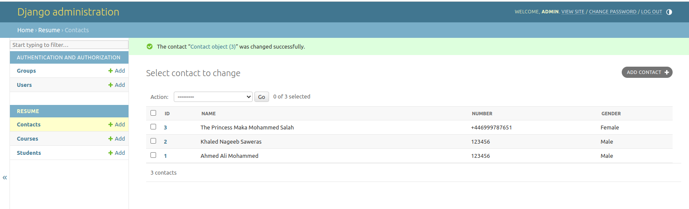

### Delete

- 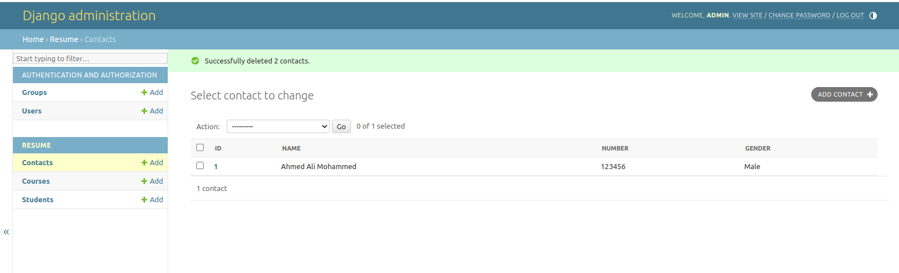
